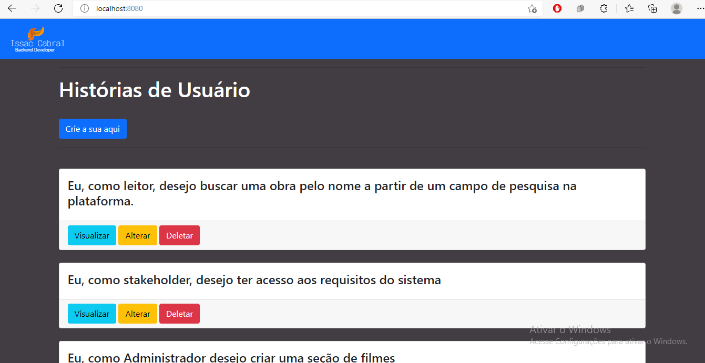
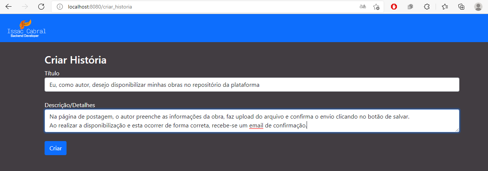
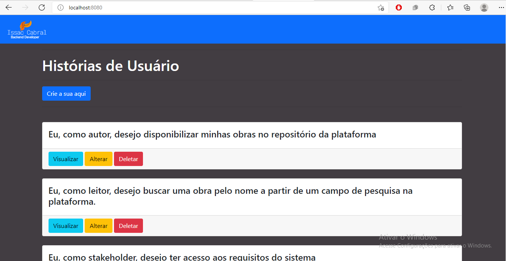
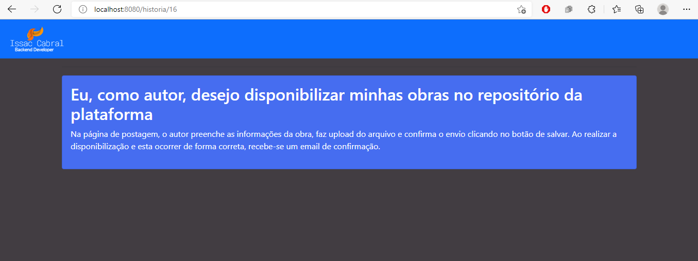
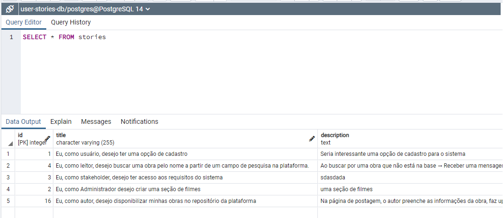

<h2>A system for registering User Stories. You can use it to help you in requirements elicitation</h2>

Technologies I used:
* Node Js
* Express
* ORM: Sequelize
* View Engine: ejs
* Postgres
* Bootstrap

ps: sorry for uploading the node modules folder xD, i forgot to configure gitignore

<h2>The project:</h2>
Here we have all the important operations and basic business rules for using user stories (full CRUD). On the Home page, all user stories from the database are listed. From there, I created some routes and used the body-parser to receive form data, intended for creating/editing the stories  

<h2>What I learned:</h2>
Basically I'm in the process of learning to use Sequelize as an ORM, I managed to understand well the configurations of routes, definitions and request and response applications and work with a view engine, and a little bootstrap, I was also able to apply the MVC pattern in my project. The next steps are to work with a service layer and create API's

<h2>Main Page:</h2>

<h2>Creating a story:</h2>

<h2>Note that the story was correctly listed</h2>

<h2>Now let's visualize it</h2>

<h2>Realize that the stories are in the database</h2>

<h3>The other update and delete options are also working</h3>

*feel free to dig through the files, thank you so much*